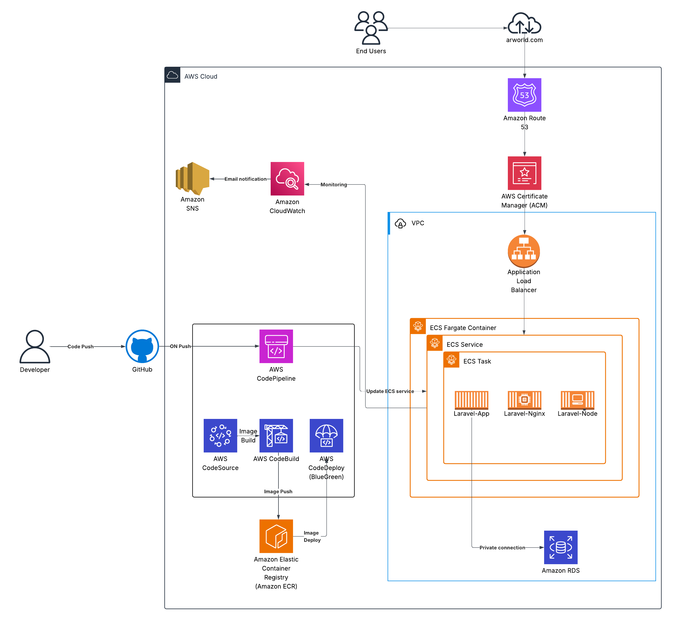

# TwoTierApplication 🚀

A **two-tier application** built with **Laravel (Backend API)**, **Node.js (Frontend)**, and **MySQL (Database)**.  
This project is fully containerized with Docker and deployed on **AWS ECS (Fargate)** with an automated **CI/CD pipeline** using GitHub → CodePipeline → CodeBuild → CodeDeploy.

---

## 🛠 Tech Stack
- **Backend:** Laravel (PHP 8, Composer)
- **Frontend:** Node.js (Yarn, Vite, React/Vue/etc. depending on config)
- **Database:** Amazon RDS (MySQL)
- **Containerization:** Docker & Docker Compose
- **Orchestration:** AWS ECS (Fargate)
- **CI/CD:** AWS CodePipeline, CodeBuild, CodeDeploy (Blue/Green Deployment)
- **Storage & Secrets:**  
  - `.env` stored in **S3**  
  - Credentials managed via **AWS Secrets Manager**  
- **Networking & Security:**  
  - **Application Load Balancer (ALB)** + Target Groups  
  - **Route53** for DNS  
  - **ACM** for SSL Certificates  
- **Monitoring & Notifications:**  
  - **CloudWatch** (logs & metrics)  
  - **SNS** (deployment notifications)

---

## 📂 Project Structure
```
TwoTierApplication/
│── app/                # Laravel backend app code
│── bootstrap/
│── config/
│── database/
│── public/             # Laravel public assets
│── resources/          # Frontend (Node.js)
│── routes/
│── storage/
│── tests/
│── vendor/
│
│── Dockerfile          # Laravel App Dockerfile
│── Dockerfile.nginx    # Nginx for serving Laravel
│── Dockerfile.node     # Node.js frontend
│── docker-compose.yml  # Local setup with multiple containers
│
│── buildspec.yml       # CodeBuild config
│── appspec.yml         # CodeDeploy config
│── taskdef.json        # ECS Task Definition for Blue/Green
│
│── composer.json / lock
│── package.json / yarn.lock
│── vite.config.js
│── .env (stored in S3 for production)
```
---

### Architecture Diagram



*Figure: Zero-downtime automated deployment with Blue/Green ECS environments.*

---

## ⚙️ Local Development (Docker Compose)

```bash
# Clone repo
git clone https://github.com/your-org/TwoTierApplication.git
cd TwoTierApplication

# Copy environment file
cp .env.example .env

# Start containers
docker-compose up -d --build

# Run migrations
docker exec -it laravel-app php artisan migrate
```

- Laravel API available at: `http://localhost:9000`  
- Node frontend available at: `http://localhost:3000`

---

## 🚀 CI/CD Workflow (AWS)

1. **Developer pushes code to GitHub**  
2. **CodePipeline** triggers:
   - **CodeBuild:**  
     - Installs dependencies  
     - Builds Node frontend (`yarn install && yarn run build`)  
     - Builds Laravel backend (`composer install`)  
     - Creates Docker images (`laravel-app`, `laravel-nginx`, `laravel-node`)  
     - Pushes images to **Amazon ECR**  
   - **CodeDeploy (Blue/Green):**  
     - Deploys new ECS task definition  
     - Performs Blue/Green deployment on ECS service  
     - Updates Application Load Balancer target group  
3. **ECS Service** updated with new version.  
4. **Route53 + ACM** provide DNS + SSL for the app.  
5. **CloudWatch & SNS** handle monitoring + notifications.

---

## 📜 Deployment Configurations

### buildspec.yml
```yaml
version: 0.2

phases:
  pre_build:
    commands:
      - echo "Logging in to Amazon ECR..."
      - aws --version
      - aws ecr get-login-password --region us-east-1 | docker login --username AWS --password-stdin <AWS_ACCOUNT_ID>.dkr.ecr.us-east-1.amazonaws.com
      - IMAGE_TAG=latest
      - echo "Image tag will be ${IMAGE_TAG}"

  build:
    commands:
      - echo "Build started on $(date)"

      - echo "Building laravel-app..."
      - docker build -t laravel-app -f Dockerfile .
      - docker tag laravel-app:latest <AWS_ACCOUNT_ID>.dkr.ecr.us-east-1.amazonaws.com/laravel-app:${IMAGE_TAG}

      - echo "Building laravel-node..."
      - docker build -t laravel-node -f Dockerfile.node .
      - docker tag laravel-node:latest <AWS_ACCOUNT_ID>.dkr.ecr.us-east-1.amazonaws.com/laravel-node:${IMAGE_TAG}

      - echo "Building laravel-nginx..."
      - docker build -t laravel-nginx -f Dockerfile.nginx .
      - docker tag laravel-nginx:latest <AWS_ACCOUNT_ID>.dkr.ecr.us-east-1.amazonaws.com/laravel-nginx:${IMAGE_TAG}

  post_build:
    commands:
      - echo "Pushing images to ECR..."
      - docker push <AWS_ACCOUNT_ID>.dkr.ecr.us-east-1.amazonaws.com/laravel-app:${IMAGE_TAG}
      - docker push <AWS_ACCOUNT_ID>.dkr.ecr.us-east-1.amazonaws.com/laravel-node:${IMAGE_TAG}
      - docker push <AWS_ACCOUNT_ID>.dkr.ecr.us-east-1.amazonaws.com/laravel-nginx:${IMAGE_TAG}

      - echo "Creating imagedefinitions.json..."
      - |
        cat > imagedefinitions.json <<EOF
        [
          {
            "name": "laravel-app",
            "imageUri": "<AWS_ACCOUNT_ID>.dkr.ecr.us-east-1.amazonaws.com/laravel-app:${IMAGE_TAG}"
          },
          {
            "name": "laravel-node",
            "imageUri": "<AWS_ACCOUNT_ID>.dkr.ecr.us-east-1.amazonaws.com/laravel-node:${IMAGE_TAG}"
          },
          {
            "name": "laravel-nginx",
            "imageUri": "<AWS_ACCOUNT_ID>.dkr.ecr.us-east-1.amazonaws.com/laravel-nginx:${IMAGE_TAG}"
          }
        ]
        EOF
      - cat imagedefinitions.json

artifacts:
  files:
    - imagedefinitions.json
    - taskdef.json
    - appspec.yml
```

---

### appspec.yml
```yaml
version: 1
Resources:
  - TargetService:
      Type: AWS::ECS::Service
      Properties:
        TaskDefinition: <TASK_DEFINITION>
        LoadBalancerInfo:
          ContainerName: laravel-nginx
          ContainerPort: 80
```

---

### taskdef.json
```json
{
  "family": "laravel-app",
  "networkMode": "awsvpc",
  "executionRoleArn": "arn:aws:iam::<AWS_ACCOUNT_ID>:role/ecsTaskExecutionRole",
  "cpu": "1024",
  "memory": "2048",
  "requiresCompatibilities": ["FARGATE"],
  "containerDefinitions": [
    {
      "name": "laravel-app",
      "image": "<AWS_ACCOUNT_ID>.dkr.ecr.us-east-1.amazonaws.com/laravel-app:latest",
      "essential": true,
      "memory": 512,
      "cpu": 256,
      "environment": [
        {
          "name": "APP_ENV",
          "value": "production"
        }
      ],
      "logConfiguration": {
        "logDriver": "awslogs",
        "options": {
          "awslogs-group": "/ecs/laravel-app",
          "awslogs-region": "us-east-1",
          "awslogs-stream-prefix": "ecs"
        }
      }
    },
    {
      "name": "laravel-node",
      "image": "<AWS_ACCOUNT_ID>.dkr.ecr.us-east-1.amazonaws.com/laravel-node:latest",
      "essential": true,
      "memory": 512,
      "cpu": 256,
      "environment": [
        {
          "name": "NODE_ENV",
          "value": "production"
        }
      ],
      "logConfiguration": {
        "logDriver": "awslogs",
        "options": {
          "awslogs-group": "/ecs/laravel-node",
          "awslogs-region": "us-east-1",
          "awslogs-stream-prefix": "ecs"
        }
      }
    },
    {
      "name": "laravel-nginx",
      "image": "<AWS_ACCOUNT_ID>.dkr.ecr.us-east-1.amazonaws.com/laravel-nginx:latest",
      "essential": true,
      "memory": 512,
      "cpu": 256,
      "portMappings": [
        {
          "containerPort": 80,
          "hostPort": 80,
          "protocol": "tcp"
        }
      ],
      "logConfiguration": {
        "logDriver": "awslogs",
        "options": {
          "awslogs-group": "/ecs/laravel-nginx",
          "awslogs-region": "us-east-1",
          "awslogs-stream-prefix": "ecs"
        }
      }
    }
  ]
}
```

---

## ✨ Author Note
This high-secure infrastructure setup and automation is designed & implemented by **Amit Rana** 💡  
Feel free to explore, learn, and adapt this for your own projects.

---
